# EclipZX

EclipZX is a Eclipse based IDE targeting development of games and applications on the PC and deploy to all models of the ZX Spectrum, including modern reboots such as the ZX Spectrum Next.

Building on the shoulders of giants, such as Boriels ZX Basic, Z88DK, and JSpeccy, EclipZX aims to bring it all together with other new purpose built tools.

It consists of a suite of Eclipse plugins, all packaged up together in an an easy to use but powerful (nearly) all-in-one development kit.

Get EclipZX [here](https://bithatch.co.uk/?page_id=344) for Windows, Linux and Mac OS

## Features

 * Boriel ZX Basic support. Write your games and applications in a modern ZX Basic that compiles to machine code.
 * Z88DK C support. Write your games and applications in C.
 * Z80 Assembly Language support (Z88DK/ZX Basic assembler compatible).  Write your games and applications in pure Z80.
 * Mix all 3 languages in a single project, view and navigate generated assembler for high level languages.
 * 3 Workbench layouts, each designed for a particular task. ZX Coding, ZX Debugging and ZX Media.
 * Define multiple SDKs for both ZX Basic and Z88DK and select the one to use with your project. E.g. A recent version of Boriels SDK will be bundled, but you can always download your own.
 * EclipZX adds concept of User Libraries to ZX Basic that you can share with others to use in their EclipZX projects. Comes with one example implementation, the great NextLib.
 * Deploy to any number of common formats such as NEX, TGZ, TAP, SNA and more.
 * Fully featured built in emulator based on Zoxo - My own JSpeccy Fork (Original ZX Spectrum family only)¹.
 * Click+Run your source file, it will be built and deployed to your chosen emulator.
 * Comes with emulator launch templates for MAME, CSpect and Zesarux. 
 * Debugging support for internal emulator and external emulators that support DeZOG and GDB (tested with MAME and CSpect)¹ .
 * Create, Format and Manage FAT16/FAT32 disk images, for deploying your games on SD 
   cards for the next. The same system is used for launching emulators that support SD card images. 
 * Application export to Zip your SD card images or directory structures for publishing.
 * For ZX Next support, generated disk images can be based on Next ZXOS. 
 * ZX Next Sprite editor, and UDG / Character set Editors for original Spectrums.
 * ZX Next palette editor.
 * ZX Next tilemap editor.
 * Manual and automatic graphics image format conversion
 * A screen editor supporting .SCR for original video modes, and all new ZX Next modes¹ .
 * Compress and decompress files using ZX0. 
 * AYFX Effects Editor.
 * Various project creation wizards, imports and exports.
 * Highly configurable globally and at the project level.
 * Infinitely expandable with compatible plugins from the Eclipse Marketplace.
 * Experimental built in ZX Basic interpreter where you can test short pieces of code¹.

*¹ Under development now*

## Screenshots

 * 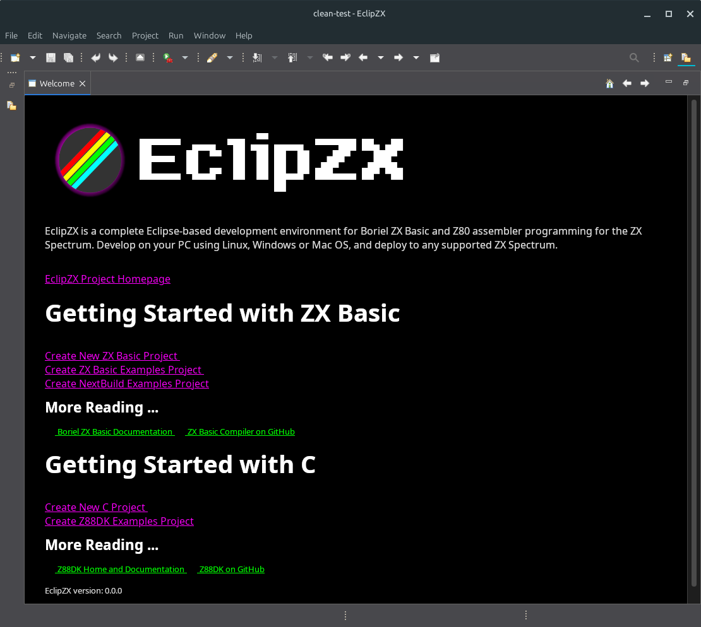
 * 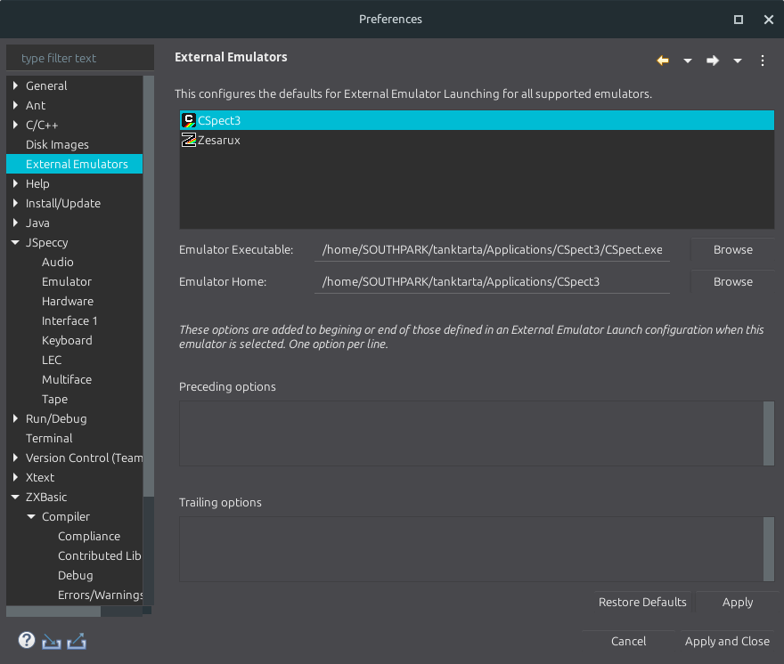
 * 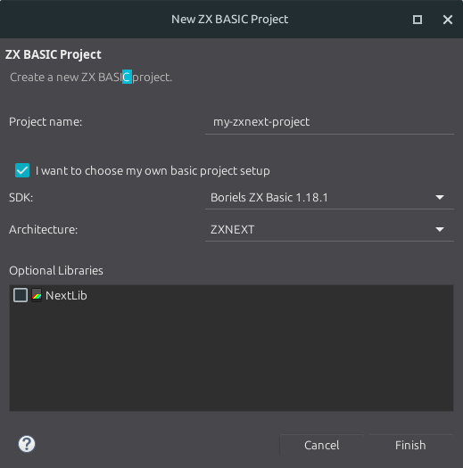
 * 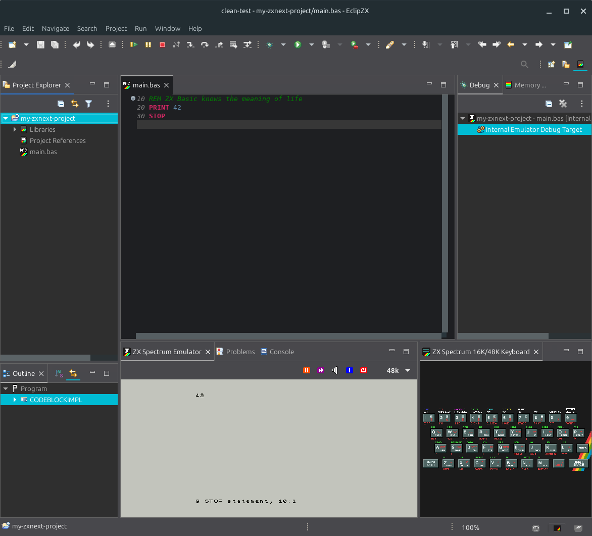
 * 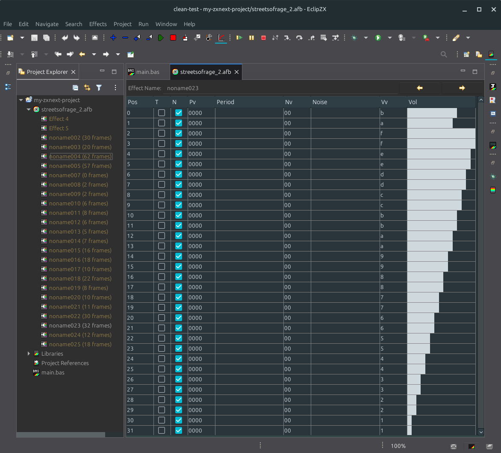
 * 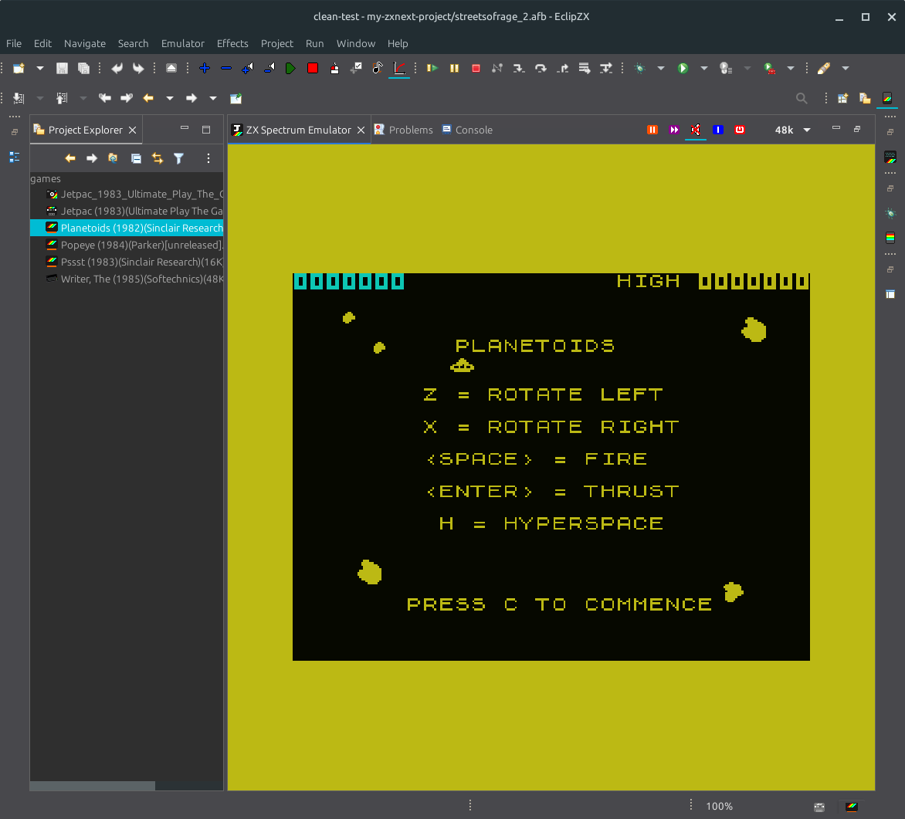
 * 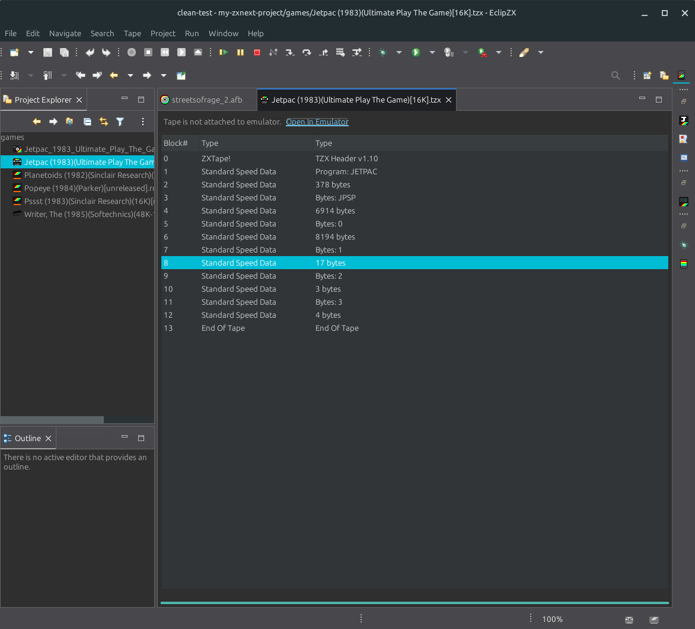
 * 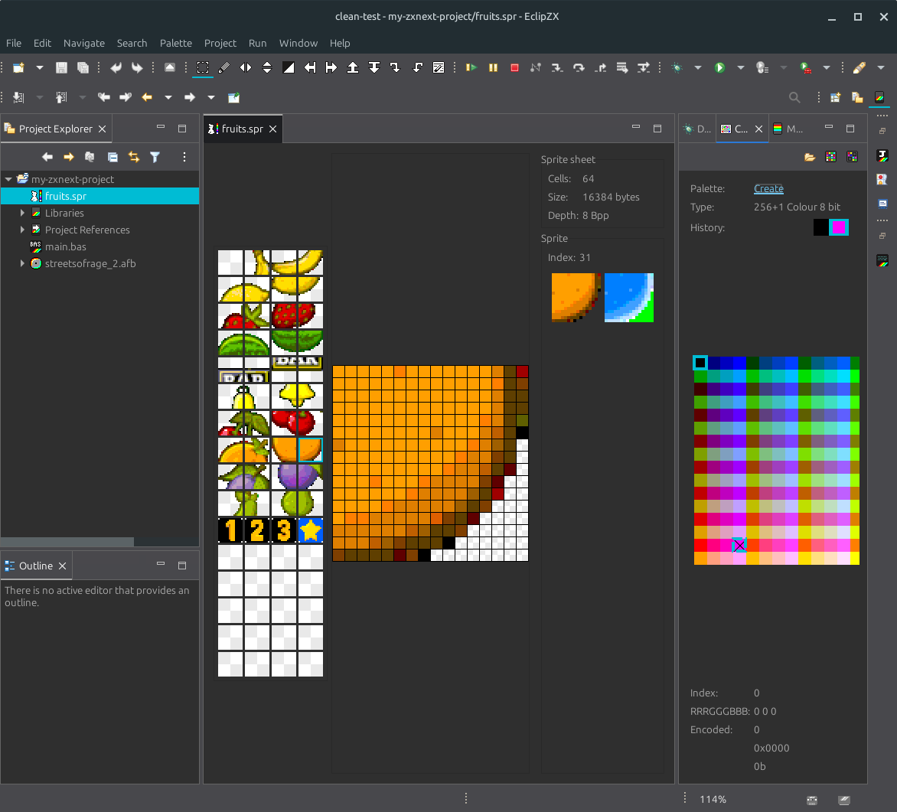
 * 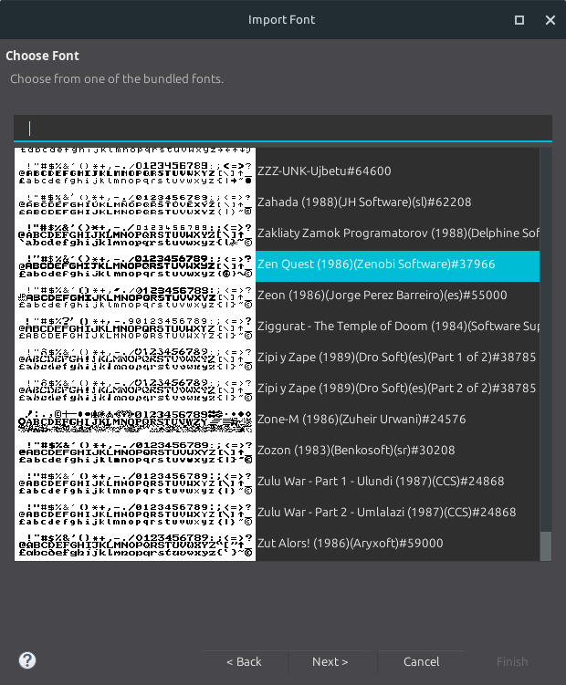
 * 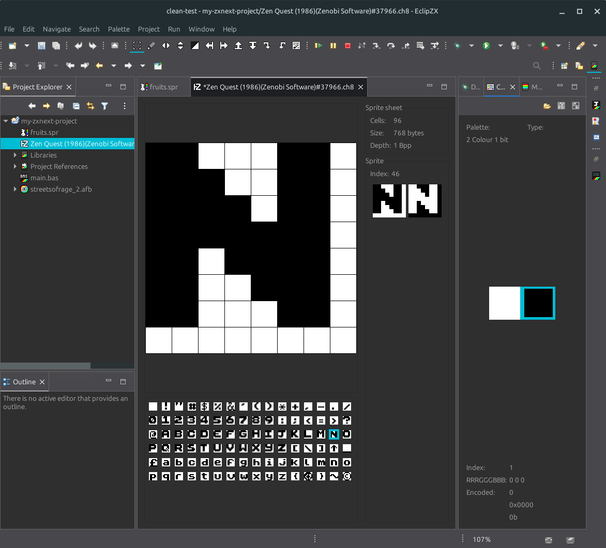
 * 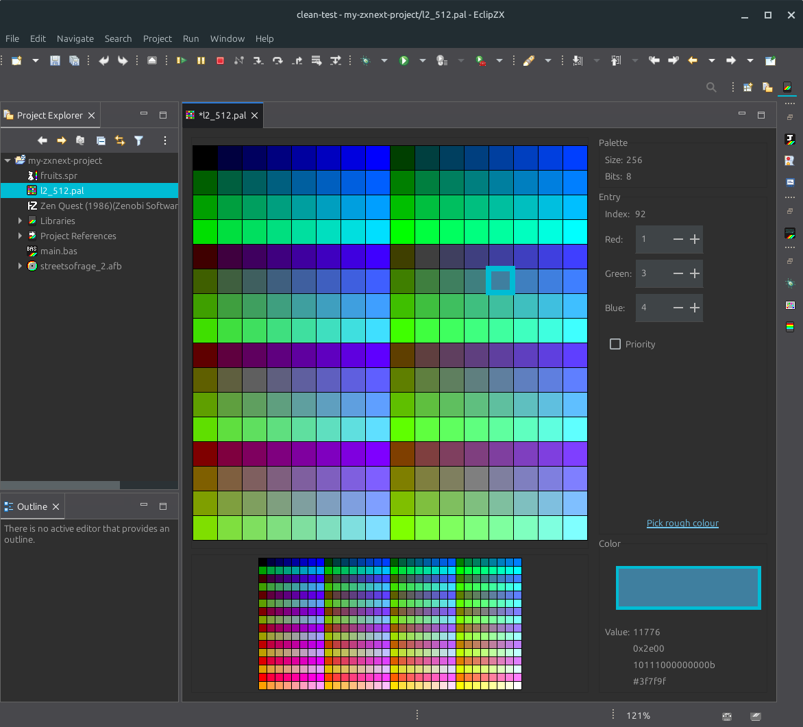
 
## Status as of 6/06/2026

The ZX Basic perspective has been removed and replaced with 3 separate perspectives, ZX Coding, ZX Debugging and ZX Media. Each perspective lays out the workspace in a sensible default manner for the currently focused task. I encourage you to use this feature! 

**The existing ZX Basic perspective will remain if you have ever used EclipZX. It is safe to remove**

The Zoxo internal debugger is now taking shape, I expect for this to be fully available in a day or two.
 
## Status as of 4/06/2026

As part of completing the debugger architecture, the latest round of changes have been to integrate Zoxo, my own fork of JSpeccy. The were several reasons to do this. JSpeccy was chosen because its 1) Java 2) Pretty complete. However the original author was not really interested in ZX Next compatibility, so I decided to fork and started on route to adding this. After many diversions (a lot of the reason EclipZX as a whole has gone slower than I'd hoped), Zoxo is finally at a point where it can replace JSpeccy inside. The main advantages of Zoxo over JSpeccy are ...

 * Highly modular. There will be future EclipZX plugins that add further features (ZX Next compatibility, Joystick support, and lots more). It also means Add-ons can be added and removed while running, although with results as unpredictable in real-life! (although without the damage).
 * More renderers. The default is now the new pure SWT renderer. The SWT+Swing renderer will also be included as an option, along with an accelerated SWT+GL renderer for some platforms.
 * Integrated DeZOG debugger. Zoxo has initial DeZOG support that I can now  complete and fully integrate with the Eclipse debugger. 
 
Basically, I decided the effort of back-porting DeZOG to the original JSpeccy fork was better put into integrating Zoxo into EclipZX, so here we are.

NOW I can move on to the actual debuggers.
 
## Status as of 31/05/2026

**The configuration attributes uses in `.launch` files have changed in the latest build,
you will likely need to recreate any launchers**

EclipZX now has much improved pure Z80 project support, with wizards to create assembly projects, cross-referencing of labels in source files, and more. It includes a built-in Z80 assembler, but not all instructions yet implemented. Simple programs will work though, see the example created main.c for a working example.

The Z88DK and Boriel assemblers are still currently uses for their respective project types, but having it's own built-in assembler will ultimately make the end of goal of being able to navigate and debug between assembly and C and assembly or basic much easier. Thanks to having Xtext and good working grammar meant creating an assembler was not a huge leap anyway.

There has also been a lot of work factoring out features that started life as part of the ZX Basic but now are more useful as general framework for any supported language (NEX generation, map file creation for debuggers and more).

Overall, EclipZX is getting very close to feature completeness as I had imagined it. Just a rough list of whats left ...

 * The screen editor still needs completing
 * Now that the architecture is better for supporting multiple languages, I can complete Debug support using (e.g. CSpect+DeZOG+GDB and others) with breakpoints and working active instruction tracking, stepping, register queries and memory inspection. 
 
The Elephant in the room is the ZX Basic grammar. It still has some parsing issues that I am having difficulty in resolving. The goal of course is to be 100% compatible with Boriels Basic, but there are hard to reconcile ambiguities that occur when trying to model ZX Basic with Xtext. 
 
## Status as of 23/05/2026

**You may need to recreate your Z88DK projects to take advantages of the build improvements. I suggest deleting .project, .cproject and .settings and using the "New Z88DK C Project" wizard**

The Z88DK side of EclipZX has been much improved, and its now possible to manage larger and more complex programs without touching a `makefile`. You can now set per-file compilation and linking options, which is required if you want to make use of [Banking](https://specnext.dev/blog/2024/12/10/everything-you-wanted-to-know-about-z88dk-paging-segmented-memory-addresses-but-were-afraid-to-ask/).

The build directory structure (i.e `Debug` or `Release` folders) now correctly mirrors your source layout, with each source file having its own makefile entry. By using CDT properly in this way, incremental Z88DK builds of your projects will now be *much faster*.

## Status as of 09/05/2026

Development is slower than I'd like, but slowly things are getting polished. The AYFX editor is much improved, and there is now an emulator launch template for MAME. The base Eclipse version has been refreshed (now based on 4.39).

## Status as of 25/11/2025

Finallly the sources for EclipZX are published, along with it related dependencies [Zyxy](https://github.com/bithatch/zyxy),  [Bithatch Maven P2](https://github.com/bithatch/bithatch-maven-p2), A fork of [JInput](https://github.com/bithatch/jinput) A fork of [FAT32-Lib](https://github.com/bithatch/fat32-lib) and a fork of [JSpeccy](https://github.com/bithatch/JSpeccy).

Pre-built binaries for Linux (X86_64 and AArch64), Mac OS  (X86_64 and AArch64) and Windows (X86_64) will be available soon.

## Status as of 21/11/2025

Well, I am pretty behind on this. There have been a number of unexpected blockers to this. A lot of it is down to my unfamiliarity with the OSGi and the Eclipse platform when it comes to assembling complete products that work on all operating systems. I am slowly fighting my way through it though, and will hopefully publish at least something before  the year is out.

There were other diversions too, mostly around improving the built-in emulator that I hoped to have made more progress than has actually been made (good Joystick support being a large part, and lots lots more that will become obvious). 

## Status as of 15/08/2025

EclipZX has already undergone heavy private development, and is coming close to be in a state
ready for public consumption. 

The plan is to release the first public beta version along with the uploading all the source 
to this repository and opening the issue tracker at point early September 2025.

## The Future

It depends on interest of course. But I will be using these tools myself, so it will likely be kept to date. 

But if there is interest, more and better Emulator supports, and more platforms and graphics formats are the obvious areas where EclipZX could be expanded, even beyond the Sinclair range.

## License

EclipZX plugins will be licensed under the usual Eclipse Public License version 2, and any original support libraries will be under a liberal license as possible (likely MIT). 

Binary builds will be available as pay-what-you-want with no minimum. EclipZX is and will always bee free and open source.
